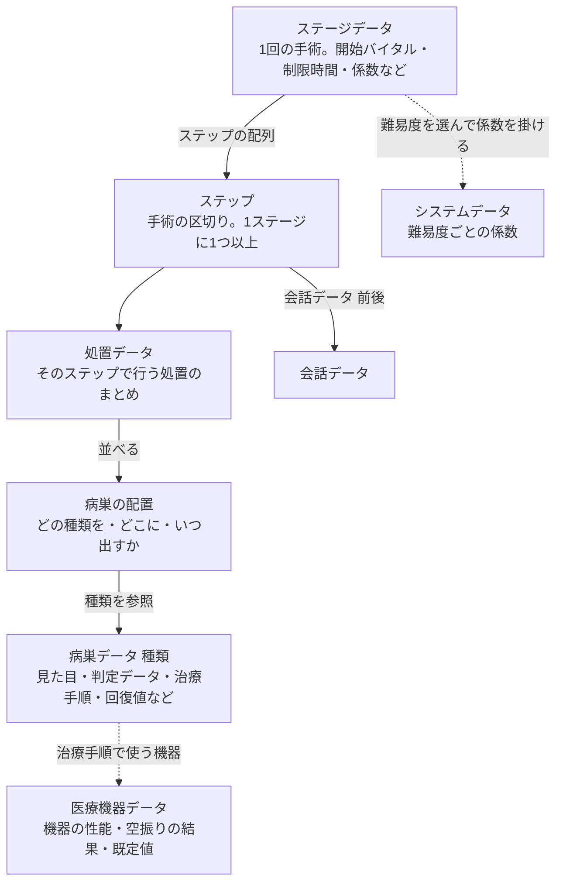

# 01 ゲーム概要

- ステータス：草案
- 最終更新：2026-10-09

> この章は仕様書の入口です。最初に 0 章（全体像）を読み、そのあと 0.2 の読み順に従って各ファイルを読んでください。

## 0. 全体像

### 0.1 このゲームを一言で言うと

- **画面の横に並んだ6種類の医療機器から1つを選び、患者の体（手術エリア）に現れた傷・腫瘍などの「病巣」を、決まった順番で治療していく2D の手術アクションゲーム。** リアルタイムで進み、治療に失敗する・時間がかかるとバイタル（患者の生命力）が減り、0 になるとゲームオーバー。
- ブラウザ（HTML5）で動き、タッチとマウスの両方で遊べる。
- 参考にしたゲームは「超執刀カドゥケウス」（以降「**本家**」と呼ぶ）。**本家を知らなくても実装できるよう、必要な内容は仕様書の中に書く。** 本家と違う部分（2D であること、固有名詞を基本的に流用しないことなど）は 4 章。

### 0.2 仕様書の読み順

| 順 | ファイル | 読むと分かること |
|---|---|---|
| 1 | この 01（概要） | ゲームの全体像、用語、データの階層（0.3、0.4） |
| 2 | [glossary.md](glossary.md) | 用語の定義（分からない言葉が出たらここ） |
| 3 | [02_screens.md](02_screens.md) | 画面の種類と遷移、ゲーム画面のレイアウト、メニュー、セーブ |
| 4 | [03_game_rules.md](03_game_rules.md) | バイタル、麻酔、制限時間、クリア・ゲームオーバー、点数とランク、係数・難易度 |
| 5 | [04_surgery_area.md](04_surgery_area.md) | 手術エリアのマス目と座標、当たり判定、患者の表現 |
| 6 | [05_instruments.md](05_instruments.md) | 6種類の医療機器の操作方法と、操作の結果（成功・失敗・無効・空振り） |
| 7 | [06_lesions.md](06_lesions.md) | 病巣の種類と治療手順（作成途中） |
| 8 | [07_data_format.md](07_data_format.md) | どの値をどのデータファイルに持つか、ステージデータの構成 |
| 9 | [08_assets.md](08_assets.md) | フォルダ構成と必要な素材 |

- 決まっていないことは `TBD-ファイル番号-連番` で示す。確定ではないが推奨案を書いた箇所は **【仮案・未確認】** と明記する（記述ルールは [README.md](README.md)）。

### 0.3 主な用語（詳細は [glossary.md](glossary.md)）

| 用語 | ひとことで |
|---|---|
| 手術エリア | ゲーム画面の中央にある、手術を行う領域。正方形のマス（横100×縦50）に分けてある |
| 病巣 | 手術エリアに現れる治療対象（傷、破片、腫瘍など）。病巣ごとに治療手順（どの機器をどの順に使うか）が決まっている |
| 医療機器 | プレイヤーが選んで使う6種類の道具（ヒールゼリー、ドレーン、ピンセット、メス、縫合針、注射）。これとは別に、特別機器としてテーピングがある（[05_instruments.md](05_instruments.md) 4章） |
| バイタル | 患者の生命力（0〜99）。0 でゲームオーバー |
| ステージ | 1回の手術の場面（1人以上の患者）。会話 → ゲーム → リザルト → 会話で1セット（ゲーム画面の中で複数のステップが進む） |
| ステップ | ステージの中の手術の区切り（例：切開 → 内臓）。ステージは1つ以上のステップでできている |
| 係数 | 基本値に掛けて、ステージごと・難易度ごとに数値を補正する倍率（[03_game_rules.md](03_game_rules.md) 6章） |

### 0.4 データの全体構造

ゲームの中身（どんな手術か）は、次の階層のデータで表す。上から下へ「含む」関係で、医療機器データだけは独立している。

| 階層 | データ | 持つもの | 詳しくは |
|---|---|---|---|
| 1 | ステージデータ | 開始バイタル、自然減少、制限時間、努力目標、ステージ係数、ステップの配列 | [07](07_data_format.md) 5章 |
| 2 | ステップ | 治療前の会話、処置データ、治療後の会話 | [07](07_data_format.md) 5.1、5.4 |
| 3 | 処置データ | 病巣の配置の並び、処置中の会話 | [07](07_data_format.md) 5.4 |
| 4 | 病巣の配置 | 病巣の種類、位置（マス座標）、出現条件、この配置だけの上書き値 | [07](07_data_format.md) 5.3 |
| 5 | 病巣データ（種類） | 見た目、判定データ、治療手順、回復値、ダメージ値、時間による変化 | [07](07_data_format.md) 4章、[06](06_lesions.md) |
| 6 | 医療機器データ | 機器ごとの性能（ストック数、筆の半径、判定範囲など）、空振りの結果、失敗の既定値 | [07](07_data_format.md) 3章、[05](05_instruments.md) |
| - | システムデータ | 難易度ごとの係数 | [07](07_data_format.md) 6章 |

- 同じ値が複数の階層にあるときは、より具体的なほう（ステージの配置 > 病巣データ > 医療機器データ）を優先し、最後に係数を掛ける（[07](07_data_format.md) 2.4）。

## 1. コンセプト

- 「超執刀カドゥケウス」（本家）を参考にした手術アクションゲーム。
- タッチ操作で手術を行う（PC ではマウス）。
- 表現は 2D とする（本家は 3D）。
- シナリオ（舞台・キャラクター・各ステージの会話）は別のシナリオ原稿 [scenario.md](../scenario.md) にある。**仕様書の外にある原稿のため、実装に必要な内容は仕様書側にも書く**（5.3）。ゲームの舞台は、戦争後の国で、囚われの身の非合法の医師（主人公）が患者を手術する、という設定。

## 2. プラットフォーム・販売形態

| 項目 | 内容 |
|---|---|
| 販売形態 | 買い切り |
| 実装技術 | HTML5（ブラウザで動作） |
| 入力 | Pointer Events（ブラウザ標準の入力イベント）を使い、タッチとマウスを同じ仕組みで扱う |
| 画面の向き | 横向き固定 |
| 画面比率・解像度 | 16:9 固定。内部解像度 1920×1080 で描画し、縦横比を保ったまま実際の画面サイズに合わせて拡大縮小する。余った部分は黒塗りにする（下の 2.1） |
| 開発時の確認環境 | PC ブラウザで確認し、後からタブレットに対応する |
| 配信形態 | 将来、スマホ向けは Capacitor、PC（Steam など）向けは Electron などでアプリ化する（時期・方法は `TBD-01-1`） |

### 2.1 画面サイズへの合わせ方

- 内部解像度 1920×1080（16:9）の画面を、**縦横比を変えずに**拡大縮小する（引き伸ばして比率を変えることはしない）。
- 画面全体がちょうど収まるよう、**幅と高さのうち余裕の少ないほうに合わせる**。余った部分は黒塗りにする。

| 端末の画面 | 合わせる辺 | 黒塗りにする部分 | 例 |
|---|---|---|---|
| 16:9 より横長 | 高さ | 左右 | 18:9 のスマホ |
| 16:9 より縦長 | 幅 | 上下 | 4:3 のタブレット |
| 16:9 | （ぴったり） | なし | 一般的な PC モニター |

- **補足**：画面比率を固定するのは、手術エリアのマス目を常に正方形に保つため（[04_surgery_area.md](04_surgery_area.md) 1章）。ゲーム性を保つための必須の仕様。
- **補足**：最初にブラウザで作っておけば、同じプログラムをスマホ・タブレット・PC のどれにも展開できる。

## 3. 操作方式

### 3.1 入力手段

| プラットフォーム | 操作 |
|---|---|
| スマートフォン／タブレット | タッチ操作 |
| PC | マウス操作。医療機器の切り替えはキーボードの 1〜6 キー（画面の上から順に、1＝ヒールゼリー … 6＝注射）でも行える |

### 3.2 医療機器の持ち替え

- 医療機器のアイコンをタップ（クリック）して選択し、その機器で手術エリアを操作する。
- **ゲーム開始時はヒールゼリーを選択した状態**にする。
- ゲームはリアルタイムで進むため、**手術エリアは常に操作できる**（「機器を選んでいない状態」は無い）。
- 最初に触れた1本の指だけを扱う。指を離すまで持ち替えはできない（スワイプ中の持ち替えはさせない）。詳しくは [05_instruments.md](05_instruments.md) 2.5。
- **一時停止**：メニューを開いている間は停止する（決定済み）。会話では、キャラクター絵つきの会話（ステップ開始時だけ）は止め、字幕は止めない（決定、2026-10-03。[02_screens.md](02_screens.md) 3.4）。

## 4. 固有名詞の方針

- 本家の固有名詞・キャラクター・画面デザインは、基本的に流用しない。
- ただし、あえて本家と同じ固有名詞（例：ヒールゼリー）を使う場合もある。
- **固有名詞を採用するかどうかは、ユーザー（プロジェクトオーナー）が最終的に決める。** AIエージェントは懸念や代案を示してよいが、独断で名称を変えない。
- ヒールゼリー（本家由来の名称）に対応する実在の用語は調査中（`TBD-01-4`）。

## 5. 開発方針

### 5.1 最初のゴール

- **シナリオ原稿（[scenario.md](../scenario.md)）の「ステージ」に書かれた全ステージを遊べる状態**を最初のゴールとする。
- 下の表は、そのシナリオ原稿の要約（仕様書内で完結して読めるように転記した）。**各ステージの病巣・手順・難しさの具体的な内容は未定**（`TBD-01-2`。ステージ2以降の手術内容は別途決める）。

| ステージ | 内容 |
|---|---|
| ステージ1 | 主人公（医師）のみ登場。軽傷の治療のみ。チュートリアルを兼ねる。チュートリアル専用の強調表示は設けず、出ている病巣に合わせた医療機器の自動の強調表示（[05_instruments.md](05_instruments.md) 2.8）で足りるとする |
| ステージ2 | 助手が登場。本格的な外科手術 |
| ステージ3 | 会話の選択肢によって**処置の内容が変わる**分岐がある（結果は変わらない）。処置内容の分岐の動作確認を兼ねる。ステージ選択時の難易度（[03_game_rules.md](03_game_rules.md) 6.3）とは別 |
| ステージ4 | シナリオ分岐がある。助手に薬を投与するかどうかの選択による分岐（内容は未定） |
| ステージ闇落ち | クリアでエンディング（分岐の一方） |
| ステージ光落ち | クリアでエンディング（分岐のもう一方） |

### 5.2 進め方

- 必須の機能は、実装を始める前に仕様として洗い出して考慮しておく。後から作り直しにならないようにするため。
  - 例：シナリオ分岐・フラグ、処置内容の分岐（ステージ3）、ステージ選択時の難易度、コンティニューポイント、エンディング、セーブ、複数の病巣の同時発生。
- ステージの間に追加ステージを入れる可能性がある。ステージを後から足しやすいデータ構造にする（0.4）。

### 5.3 元資料の扱い

- 仕様書の本文は、**仕様書だけを読んで実装できること**を目指す。
- 仕様書の外にある資料は、次の位置づけ。実装者が読めなくても本文は成り立つようにする。

| 資料 | 位置づけ |
|---|---|
| memo.md | 最初のアイデアメモ。内容は仕様書に移した（原本のため変更しない） |
| scenario.md | シナリオ原稿（舞台、キャラクター、ステージ構成、会話テキスト）。会話テキストの一部は旧い操作の説明を含む。ステージのデータ化のときに、仕様書に合わせて書き換える |
| _records/ | 決定の経緯の記録（提案書、作業記録）。各表の「提案ID」列（A1、R1、M1 など）はこの記録の番号で、経緯をたどるための印。**本文の理解には不要** |

## 6. 未決事項

| ID | 内容 | 提案ID |
|---|---|---|
| TBD-01-1 | アプリ化（ストア配信）の時期と方法 | A1 |
| TBD-01-2 | 最初のゴールに必要な機能の一覧（必須機能の洗い出し）、ステージ2以降の手術内容 | A4 |
| TBD-01-4 | ヒールゼリーに対応する実在の医療用語の調査（名称そのものを変えるかはユーザーが決める） | - |

- 欠番（解決済み・再利用しない）：`TBD-01-3`（画面の拡大縮小の合わせ方。2.1 に反映済み）。
