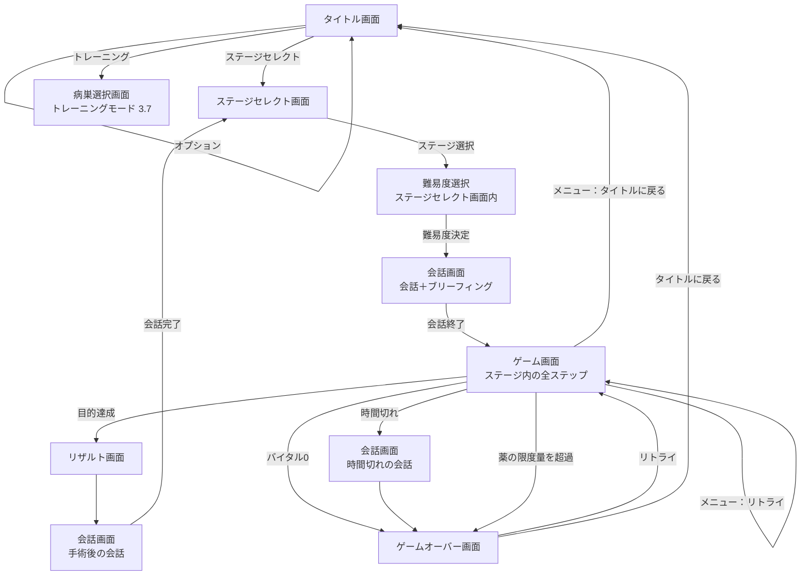
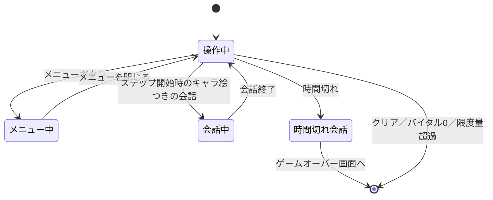
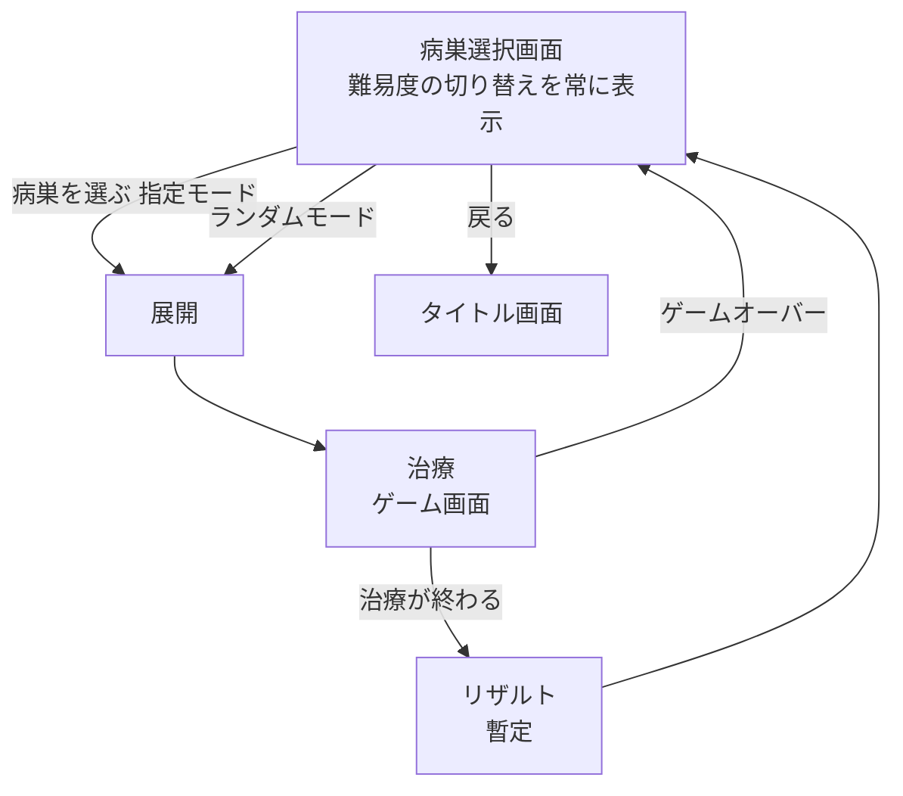

# 02 画面仕様

- ステータス：草案
- 最終更新：2026-10-03

> **この章の【仮案・未確認】について**：決定記録に無い規則を補うために、推奨案を **【仮案・未確認】** と明記して書いた箇所がある。ユーザーの確認が済むまで確定ではない（対応する TBD は 5 章）。

## 1. 画面一覧

| 画面 | 概要 |
|---|---|
| タイトル画面 | ステージセレクト、トレーニング、オプションを選択できる |
| ステージセレクト画面 | ステージ選択。シナリオのフローチャートを兼ねる。ステージを選ぶと、同じ画面の中で難易度選択に移る |
| 会話画面 | キャラクターの会話、ブリーフィング。ステージの前（ブリーフィング込み）、手術後、時間切れのときに使う |
| ゲーム画面 | 手術を行う。**1ステージにつきゲーム画面は1つ**で、ステージの中のステップ（手術の区切り）はこの画面の中で進める（【仮案・未確認】 2.1、`TBD-02-13`） |
| ゲームオーバー画面 | リトライかタイトルに戻るかを選ぶ |
| 病巣選択画面（トレーニングモード） | 治療したことのある病巣を選んで練習する。難易度の切り替えを常に表示する（3.7） |
| リザルト画面 | 手術結果の評価。**ステージ単位**で1回表示する（ステップごとには表示しない）（【仮案・未確認】 2.1、`TBD-02-13`） |

## 2. 画面遷移

- 限度量の超過（[05_instruments.md](05_instruments.md) 3.6）では、時間切れと違って会話を挟まず、直接ゲームオーバー画面へ移る（【仮案・未確認】。会話を挟むかは `TBD-02-12`）。
- 以降、ステージごとに上の流れを繰り返す。
- トレーニングモードの中の流れは 3.7。

### 2.1 画面遷移とステップの対応【仮案・未確認】

ステージデータはステップの配列で、各ステップは「治療前の会話 → 処置 → 治療後の会話」を持つ（[07_data_format.md](07_data_format.md) 5.1、5.4）。これと上の遷移図は次のように対応させる（`TBD-02-13`）。

| ステージデータの要素 | 画面 |
|---|---|
| 最初のステップの「治療前の会話」 | 遷移図の「会話画面（会話＋ブリーフィング）」 |
| 各ステップの「処置」 | ゲーム画面 |
| 途中のステップの前後の会話、処置中の会話 | ゲーム画面の中で表示する（3.4）。画面は切り替えない。ステップの間（ステップ開始時）の会話はキャラクター絵つきの会話（止める会話）、処置中の会話は字幕（決定、2026-10-03） |
| 最後のステップの「治療後の会話」 | 遷移図の「手術後の会話」（リザルト画面のあとの会話画面） |
| ステージ全体 | リザルト画面（ステージ単位）、ゲームオーバー画面（ステージ単位） |

- **理由**：ステップごとにリザルトやゲームオーバーを挟むと、バイタル・制限時間・点数がステップ単位に分かれてしまう。制限時間とバイタルはステージ全体で1つとして扱う（03）。

### 2.2 ゲーム画面の中の状態【仮案・未確認】

- 「操作中」は時間もバイタルの減少も進み、字幕（3.4）は流れる。「メニュー中」「会話中」「時間切れ会話」では進行を止める。
- 「会話中」に入るのはステップの間（ステップ開始時）だけ（決定、2026-10-03。3.4 の「会話の表示」）。

## 3. 各画面の仕様

### 3.1 タイトル画面

- 選択肢は「ステージセレクト」「トレーニング」「オプション」。
- ニューゲームの概念は無い。
- 「ステージセレクト」を選ぶとステージセレクト画面へ移る。
- 「トレーニング」を選ぶと病巣選択画面（トレーニングモード。3.7）へ移る。
- 「オプション」はタイトル画面のまま選択肢を表示する（画面遷移しない）。

#### オプション項目

| 項目 | 内容 | 初期値 |
|---|---|---|
| 医療機器の配置 | 左右の入れ替え（3.4 のレイアウトの左右が入れ替わる） | 左 |
| SE 音量 | 効果音とボイスの音量（ボイスは SE と同じ扱いにする） | TBD |
| BGM 音量 | BGM の音量 | TBD |
| 文字送り速度 | 会話画面の文字の表示速度 | TBD |
| 会話画面全スキップ | 会話画面をすべて飛ばす。選択肢のあるステージでは選択肢だけ選べる。ブリーフィングは飛ばさない（【仮案・未確認】、`TBD-02-18`） | TBD |

- ボイス専用の音量設定は設けない。
- セーブデータの消去機能は設けない（3.2 のとおり、最初のステージを選ぶことがニューゲームと同じになるため）。
- 各項目の初期値は `TBD-02-5`。ほか、必要に応じて追加する。
- 医療機器の強調表示（3.4）のオン・オフの項目は設けない（常に表示する。暫定。2026-10-03）。

### 3.2 ステージセレクト画面

- ステージセレクトの最初のステージが、実質的なニューゲームになる。
- シナリオのフローチャートを兼ねる。分岐がある。
- **開放済みのステージだけを表示する。** 未開放のステージは表示しない。どのステージをいつ開放するか（開放条件）は、ステージデータに持つ（[07_data_format.md](07_data_format.md) 5.2）。
- ステージどうしを線で結び、流れと分岐を示す。
- クリア済みのステージには、獲得したランクを表示する。複数回クリアしたときは**最高ランクを表示する**（【仮案・未確認】、`TBD-02-9`）。
- 選択肢のあるステージは、それが分かるように表示する。
- ステージを選択すると、**難易度を選んでから**会話画面へ移る（難易度の仕様は [03_game_rules.md](03_game_rules.md) 6.3）。
  - 難易度はステージごとに、選ぶたびに決める。オプションで一律に設定する方式にはしない。
  - 前回そのステージで選んだ難易度を初期表示にするかは `TBD-02-11`。

### 3.3 会話画面

#### 構成

- 背景、左右にキャラクターの立ち絵、下に名前欄付きの会話ウィンドウというシンプルな構成。
- 選択肢があり、フラグ（選択の結果などを覚えておく印。[glossary.md](glossary.md)）で管理する。
- ゲーム画面の字幕エリア（3.4）とは別物。ここでの「会話ウィンドウ」は会話画面の下部の名前欄付きのウィンドウを指す。

#### ブリーフィング

- 主な会話の後にブリーフィングを入れる。会話画面のまま、背景や音楽で切り替わりを表現する。
- 目的：病状の説明（＝ステージ説明）と、クリア目標の確認。
- 表示する内容：
  - クリア目標
  - ゲーム中の努力目標（達成すると高ランク。[03_game_rules.md](03_game_rules.md) 4章参照）
- 会話が終わるとゲームを開始する。

### 3.4 ゲーム画面

#### レイアウト

医療機器を左側に置いた場合の配置（オプションで左右反転）。手術エリアは横2：縦1 で、正方形のマスに分割する（各エリアの大きさは [04_surgery_area.md](04_surgery_area.md) 1.3）。

- 図は論理座標（1920×1080）の半分のスケール（960×540）で描いてある。バイタルゲージの塗りや顔画像の人物シルエットは、配置を示すためのサンプルで、仕様ではない。

| 要素 | 位置 | 内容 |
|---|---|---|
| バイタルゲージ | 画面上部（中央） | [03_game_rules.md](03_game_rules.md) 参照 |
| 残り時間 | **医療機器の反対側の上端** | 制限時間の残り。医療機器を左に置けば右上、右に置けば左上 |
| 医療機器 | 画面左側か右側（オプション）、縦に6つ | [05_instruments.md](05_instruments.md) 参照。今使うべき機器を強調表示する（下の「医療機器の強調表示」） |
| メニューボタン | 医療機器の列の最上部（04 1.3 の Menu） | 「リトライ」と「タイトルに戻る」（`TBD-02-16`） |
| 空白エリア | 医療機器の反対側（残り時間の下） | 普段は何も置かない（背景のみ）。ピンセットで物を掴んでいる間だけトレイを表示する（[05_instruments.md](05_instruments.md) 3.3）。テーピング（特別機器）のテープもここに出す（[05_instruments.md](05_instruments.md) 4章）。トレイもテープも、**画面の枠外から出てくる演出つき**で現れる（移動先・使う物だと分かるように） |
| 字幕エリア（リアルタイム会話ウィンドウ） | 画面下部（中央） | 左に話者の顔画像、右に字幕。必要に応じて表示 |
| 手術エリア | 上記以外の中央 | [04_surgery_area.md](04_surgery_area.md) 参照 |

- 医療機器を左右入れ替えたとき、入れ替わるのは医療機器の列と、その反対側の列（残り時間・空白エリア）。バイタルゲージ・手術エリア・字幕エリアは中央に固定のまま動かさない（【仮案・未確認】、`TBD-02-17`）。

#### 会話の表示

ゲーム画面で会話を表示する方法は2つある。2つは**完全に別物**（決定、2026-10-03）。

| 方法 | 見え方 | 出すタイミング | ゲームの進行（決定、2026-10-03） |
|---|---|---|---|
| 字幕（リアルタイム会話ウィンドウ） | 映画の字幕のように、字幕エリアに時間経過で流れる | 処置中（ステップの途中） | **止めない**。時間もバイタルの減少も進み、手術エリアも操作できる |
| キャラクター絵つきの会話（治療を止める会話） | 会話画面と同じ表示（立ち絵＋名前欄付きの会話ウィンドウ）を、ゲーム画面に重ねて出す。しっかり会話させたいときに使う | **ステップの間（ステップ開始時）だけ**。常にあるものではなく、ステージデータで指定したときだけ出す | **止める**。会話が終わるまで、時間・バイタルの減少・回復（ストック・ゲージの回復、麻酔の残り時間など）・操作をすべて止める |

- **キャラクター絵つきの会話を出すとき、表示中の字幕は打ち切る**（治療が早いと、字幕の途中で会話が出ることがあるため）。
- **指定の病巣が出たときに会話を出したい場合も、ステップ開始時と同じ扱い**にする。つまり「病巣の治療 → 会話 → 次の病巣」は、ステップを分けて書く（[07_data_format.md](07_data_format.md) 5.4）。ステップの途中の会話は字幕だけ。
- キャラクター絵つきの会話を出すとき、プレイヤーが指を押していたら、**すぐに会話を出し、その操作は「離した」扱い**にする（[05_instruments.md](05_instruments.md) 2.5）。
- キャラクター絵つきの会話でも、会話画面と同じく選択肢を出せる（フラグを立てる。処置内容の分岐にも使える。[07_data_format.md](07_data_format.md) 5.5）。
- 字幕エリアの左には、話者の**顔画像**を表示する。背景透過の画像で、画像を囲む枠は付けず、人物の輪郭は表示する。字幕はその右に表示する。顔画像は立ち絵とは別の素材（[08_assets.md](08_assets.md) 3.1）。表示サイズは未決定（[04_surgery_area.md](04_surgery_area.md) 1.3）。
- 字幕は手術の操作と連動して出す必要がある（案内を字幕の順番待ちで遅らせない）。試作 v02 でも一定程度は実現できたが、より細かい粒度での連動が必要。方法は後日検討（試作 v02 の P55。テーマ5、`TBD-02-19`）。
- 会話はステップと処置データの中に置く（[07_data_format.md](07_data_format.md) 5.4）。

#### 医療機器の強調表示

- 手術エリアに出ている病巣それぞれについて、**今の段階で使うべき医療機器**を、医療機器の列で強調表示する（決定、2026-10-03）。例：軽傷ならヒールゼリー、血溜まりがあればドレーン。
- 規則の詳細（対象、省略できる段階の色分け、点滅のしかた、注射の薬ボタン）は [05_instruments.md](05_instruments.md) 2.8。
- オン・オフの設定は設けない（常に表示する。暫定）。点数・評価には影響しない。
- チュートリアル用の強調表示（シナリオデータで特定の機器を目立たせる仕組み）は**設けない**（廃止。2026-10-03）。ステージ1のチュートリアルも、この自動の強調表示で足りるとする。

#### 治療の評価の表示【再検討中】

- 【再検討中】（`TBD-03-16`。決定ではない）前回の回答（参考）：病巣1つの治療が終わるたびに、その病巣の評価（Cool／Good／Fine／Bad。[03_game_rules.md](03_game_rules.md) 5.1）を、病巣の近くに文字で表示し、評価ごとの SE を鳴らす。見た目の細部は画面・演出の検討（テーマ5）。

#### メニュー

- メニューを開いている間は一時停止する。制限時間とバイタルの減少を止める（決定済み）。
- 次のものも止める（【仮案・未確認】、`TBD-02-15`）：麻酔の残り時間、ヒールゼリーのストックと注射のゲージの回復、病巣ごとのタイマー、患者の拍動のアニメーション、字幕の流れ。つまり、ゲーム内の時間に関わるものはすべて止める。
- 手術エリアを押している最中（ポインタを押している間）は、メニューボタンを押しても反応しない（【仮案・未確認】、`TBD-02-15`）。
- メニューの選択肢は「リトライ」と「タイトルに戻る」。ボタンの形（ボタン1つを押すと選択肢が出る形か、2つのボタンを並べる形か）は `TBD-02-16`（【仮案】ボタン1つ＋ポップアップ）。

#### 操作

- ゲーム開始時はヒールゼリーを選択した状態で、手術エリアは常に操作できる（[01_overview.md](01_overview.md) 3.2）。

#### 画面の終了条件

| 条件 | 行き先 |
|---|---|
| 目的（クリア目標）を達成する | リザルト画面 |
| バイタルが 0 になる | ゲームオーバー画面 |
| 制限時間が切れる | 時間切れの会話を表示したのち、ゲームオーバー画面 |
| 薬の投与量が患者ごとの限度量を超える（[05_instruments.md](05_instruments.md) 3.6） | ゲームオーバー画面（会話は挟まない案。`TBD-02-12`） |

- 同時に複数が成り立ったときの優先順位は [03_game_rules.md](03_game_rules.md) 3章。

### 3.5 ゲームオーバー画面

- 「リトライ」か「タイトルに戻る」かを選ぶ（コンティニューは設けず、リトライに統一する）。

### リトライ（共通）

- ゲームオーバー画面とゲーム中のメニューのどちらからでも選べる。
- リトライしてもランクには影響しない。
- 以下は **【仮案・未確認】**（`TBD-02-14`、会話の繰り返しは `TBD-02-10`）。
  - **やり直す範囲**：そのステージの**最初のステップ**から、ゲーム画面をやり直す。
  - **会話**：ブリーフィングなどのゲーム前の会話は繰り返さない（`TBD-02-10` で確定する）。
  - **フラグ**：ゲーム前の会話で立てたフラグ（選択肢の結果）は保持する。
  - **選んだ難易度**：変わらない（[03_game_rules.md](03_game_rules.md) 6.3）。
  - 状態ごとの戻り方は次の表。

| 状態 | ステップが変わるとき | リトライ | ステージ開始 |
|---|---|---|---|
| バイタル | 引き継ぐ | ステージ開始時の値 | ステージデータの開始値 |
| 残り時間（制限時間） | 引き継ぐ（ステージ全体で1つ） | リセット | ステージデータの値 |
| 自然減少のタイマー | 続きから（リセットしない） | リセット | 開始から計り始める |
| ヒールゼリーのストック、注射のゲージ | 引き継ぐ | 満タン | 満タン |
| 麻酔の残り時間 | 引き継ぐ | 0 | 0 |
| 薬の投与量の累計 | 引き継ぐ | 0 | 0 |
| 選択中の医療機器 | 引き継ぐ | ヒールゼリー | ヒールゼリー |
| 選択中の薬 | 引き継ぐ | 回復剤 | 回復剤 |
| 病巣 | そのステップの配置を出す | 最初のステップの配置から | 最初のステップの配置から |
| フラグ | 保持 | ゲーム前の会話で立てた分は保持 | ステージ開始前の状態 |

### 3.6 リザルト画面

- 手術結果に応じて評価する（評価方法は [03_game_rules.md](03_game_rules.md) 5章参照）。
- 努力目標の達成状況を表示する。
- リザルトの後は会話画面（手術後の会話）に移る。会話が終わるとステージセレクト画面へ移る。

### 3.7 トレーニングモード（病巣選択画面）

ステージで治療したことのある病巣を、1つずつ選んで練習するモード（決定、2026-10-03）。

#### 入口と練習できる病巣

- タイトル画面の「トレーニング」から入る（3.1）。
- 練習できるのは「治療したことがある」病巣の**種類**（病巣データの種類ごと。ステージの配置ごとではない）。
- 「治療したことがある」は、**その病巣が出るステージをクリアした時点**で記録する（ステージ中に治療しただけでは記録しない）。記録はセーブデータに持つ（4章、[07_data_format.md](07_data_format.md) 8章）。記録の細部は `TBD-07-14`。

#### 病巣選択画面

- 練習できる病巣の一覧と、モード（指定モード・ランダムモード）を選ぶ。
- **難易度の切り替え（トグル）を常に表示する**。難易度はステージと同じ難易度（係数）を使う（[03_game_rules.md](03_game_rules.md) 6.3）。

#### 流れ

| モード | 出し方 | 病巣の位置 |
|---|---|---|
| 指定モード | 一覧から選んだ病巣を1つ出す | 手術エリアの中央 |
| ランダムモード | 治療したことのある病巣から、1つずつ連続で出す（例：5つで終わり。数は `TBD-02-21`）。同時に複数出す形は、同時多発の仕組み（`TBD-07-9`）が決まった後で検討する | ランダム（手術エリアからはみ出さない範囲） |

- 指定モード：病巣選択 → 展開 → 治療 →（リザルト）→ 病巣選択に戻る。
- ランダムモード：決めた数の病巣を1つずつ治療し終えたら、（リザルト）→ 病巣選択に戻る。
- **ルール**：バイタルあり（減少・回復・ダメージは本番と同じ）、**制限時間なし**、**ゲームオーバーあり**（[03_game_rules.md](03_game_rules.md) 3.2）。値（開始時のバイタル、自然減少、ステージ係数、患者の限度量・背景画像など）は、トレーニングモード専用の**トレーニング用ステージ**（ステージデータの形）に持つ（[07_data_format.md](07_data_format.md) 5.9）。病巣の配置は、選んだ病巣（またはランダム）から実行時に作る。
- ゲームオーバーになったら、病巣選択画面に戻る（決定、2026-10-03）。

#### リザルトとベスト記録

- 治療が終わったら、リザルトを表示する（**暫定**。テンポが悪ければ削る）。表示する内容は `TBD-02-21`。ステージのクリア状況は記録しない。
- **ベスト記録**を残す（決定、2026-10-03）：**病巣の種類 × 難易度ごとに、最高評価と最短時間**（セーブデータ。[07_data_format.md](07_data_format.md) 8章）。評価の中身は再検討中（[03_game_rules.md](03_game_rules.md) 5.1、`TBD-03-16`）。

## 4. セーブ

- **自動セーブ**とし、ブラウザのローカルストレージに保存する。
- 保存する内容：クリア状況（開放済みステージ）、ランク、フラグ、オプション設定、トレーニングモードの記録（治療したことのある病巣の種類、ベスト記録。3.7）。
- セーブデータの消去機能は設けない。
- セーブのタイミングと形式は [07_data_format.md](07_data_format.md)（`TBD-07-4`）。

## 5. 未決事項

| ID | 内容 | 提案ID |
|---|---|---|
| TBD-02-5 | オプション各項目の初期値 | B5 |
| ~~TBD-02-7~~ | **決定（2026-10-03）**：キャラクター絵つきの会話は止める（出すときは表示中の字幕を打ち切る）。字幕は止めない（3.4）。キャラクター絵つきの会話はステップ開始時だけ。字幕と操作の連動（P55）は `TBD-02-19` に分けた | A2 |
| TBD-02-8 | セーブデータがある状態で最初のステージを選び直したとき、フラグや開放状況を初期化するか。途中のステージを遊び直したときのフラグの扱い | B1 |
| TBD-02-9 | 同じステージを複数回クリアしたときに表示するランク（最高ランクか最新か）。【仮案】最高ランク | B6 |
| TBD-02-10 | リトライ時に会話・ブリーフィングを繰り返すか。【仮案】繰り返さない | B2 |
| TBD-02-11 | 難易度選択の見せ方（ステージ選択後のポップアップなど）と、前回選んだ難易度を初期表示にするか | - |
| TBD-02-12 | 薬の限度量を超えてゲームオーバーになるとき、会話を挟むか。【仮案】挟まない（警告で事前に分かるため） | - |
| TBD-02-13 | ステップ構成と画面遷移の対応（ゲーム画面は1ステージに1つ、リザルトはステージ単位、途中のステップの会話はゲーム画面内）（2.1）。【仮案】2.1 のとおり | - |
| TBD-02-14 | リトライのやり直す範囲、フラグの扱い、状態ごとのリセット（3.5 の表）。【仮案】3.5 のとおり | - |
| TBD-02-15 | メニュー中に止めるものの範囲、操作中のメニューボタンの扱い。【仮案】3.4 のとおり | - |
| TBD-02-16 | メニューボタンの形（1つ＋ポップアップか、2つ並べるか）。【仮案】1つ＋ポップアップ | - |
| TBD-02-17 | 医療機器を左右入れ替えたときの、ほかの要素（バイタルゲージ、字幕エリア、顔画像）の配置。【仮案】中央の要素は動かさない | - |
| TBD-02-18 | 「会話画面全スキップ」のときのブリーフィングの扱い。【仮案】ブリーフィングは飛ばさない | - |
| TBD-02-19 | 字幕を手術の操作と連動させる方法（より細かい粒度が必要）。試作 v02 の P55。テーマ5で検討（旧 `TBD-02-7` の残り） | - |
| ~~TBD-02-20~~ | **決定（2026-10-03）**：トレーニングモードでゲームオーバーになったら、病巣選択画面に戻る（3.7） | - |
| TBD-02-21 | トレーニングモードのリザルトに表示する内容（評価、かかった時間、ミスの数など）と、ランダムモードで出す病巣の数・選び方（例：5つ） | - |

- 欠番（解決済み、または最初の版から記録が無い。再利用しない）：`TBD-02-1`〜`TBD-02-4`、`TBD-02-6`。
