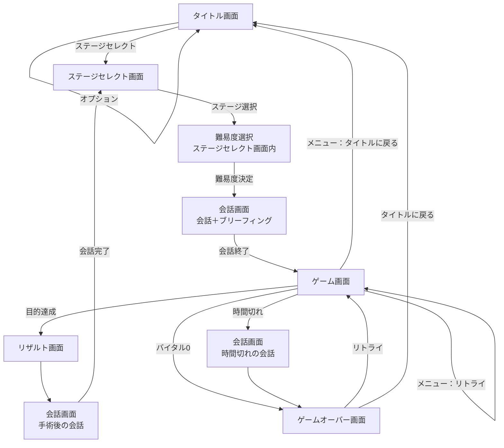

# 02 画面仕様

- ステータス：草案
- 最終更新：2026-09-25

## 1. 画面一覧

| 画面 | 概要 |
|---|---|
| タイトル画面 | ステージセレクトとオプションのみ選択できる |
| ステージセレクト画面 | ステージ選択。シナリオのフローチャートを兼ねる |
| 会話画面 | キャラクターの会話、ブリーフィング |
| ゲーム画面 | 手術を行う |
| ゲームオーバー画面 | リトライかタイトルに戻るかを選ぶ |
| リザルト画面 | 手術結果の評価 |

## 2. 画面遷移

以降、ステージごとに「会話 → ゲーム → リザルト → 会話」を繰り返す。

## 3. 各画面の仕様

### 3.1 タイトル画面

- 選択肢は「ステージセレクト」と「オプション」のみ。
- ニューゲームの概念は無い。
- 「ステージセレクト」を選ぶとステージセレクト画面へ移る。
- 「オプション」はタイトル画面のまま選択肢を表示する（画面遷移しない）。

#### オプション項目

| 項目 | 内容 | 初期値 |
|---|---|---|
| 医療機器の配置 | 左右の入れ替え | 左 |
| SE 音量 | 効果音とボイスの音量（ボイスは SE と同じ扱いにする） | TBD |
| BGM 音量 | BGM の音量 | TBD |
| 文字送り速度 | 会話画面の文字の表示速度 | TBD |
| 会話画面全スキップ | 会話画面をすべて飛ばす。選択肢のあるステージでは選択肢だけ選べる | TBD |

- ボイス専用の音量設定は設けない。
- セーブデータの消去機能は設けない（3.2 のとおり、最初のステージを選ぶことがニューゲームと同じになるため）。
- 各項目の初期値は `TBD-02-5`。ほか、必要に応じて追加する。

### 3.2 ステージセレクト画面

- ステージセレクトの最初のステージが、実質的なニューゲームになる。
- シナリオのフローチャートを兼ねる。分岐がある。
- **開放済みのステージだけを表示する。** 未開放のステージは表示しない。
- ステージどうしを線で結び、流れと分岐を示す。
- クリア済みのステージには、獲得した最高ランクを表示する（`TBD-02-9`）。
- 選択肢のあるステージは、それが分かるように表示する。
- ステージを選択すると、**難易度を選んでから**会話画面へ移る（難易度の仕様は [03_game_rules.md](03_game_rules.md) 6.3）。
  - 難易度はステージごとに、選ぶたびに決める。オプションで一律に設定する方式にはしない。
  - 前回そのステージで選んだ難易度を初期表示にするかは `TBD-02-11`。

### 3.3 会話画面

#### 構成

- 背景、左右にキャラクター、下に名前欄付きの会話ウィンドウというシンプルな構成。
- 選択肢があり、フラグで管理する。

#### ブリーフィング

- 主な会話の後にブリーフィングを入れる。会話画面のまま、背景や音楽で切り替わりを表現する。
- 目的：病状の説明（＝ステージ説明）と、クリア目標の確認。
- 表示する内容：
  - クリア目標
  - ゲーム中の努力目標（達成すると高ランク。[03_game_rules.md](03_game_rules.md) 参照）
- 会話が終わるとゲームを開始する。

### 3.4 ゲーム画面

#### レイアウト

医療機器を左側に置いた場合の配置（オプションで左右反転）。手術エリアは横2：縦1 で、正方形のマスに分割する（各エリアの大きさは [04_surgery_area.md](04_surgery_area.md) 1.3）。

| 要素 | 位置 | 内容 |
|---|---|---|
| バイタルゲージ | 画面上部 | [03_game_rules.md](03_game_rules.md) 参照 |
| 残り時間 | 画面右上 | 制限時間の残り |
| 医療機器 | 画面左側か右側（オプション）、縦に6つ | [05_instruments.md](05_instruments.md) 参照 |
| メニューボタン | 医療機器のさらに上（画面端） | 「リトライ」と「タイトルに戻る」 |
| 空間 | 医療機器の反対側 | 何も置かない（背景のみ） |
| リアルタイム会話ウィンドウ | 画面下部 | 必要に応じて表示 |
| 手術エリア | 上記以外の中央 | [04_surgery_area.md](04_surgery_area.md) 参照 |

#### 会話の表示

- リアルタイム会話ウィンドウは、映画の字幕のようなイメージで、時間経過で流れる。
- しっかり会話させたいときは、会話画面のキャラクター絵と会話ウィンドウを出す。
- 会話の表示中などはゲーム画面を一時停止する（どの場面で停止するかは `TBD-02-7`）。

#### メニュー

- メニューを開いている間は一時停止する。制限時間とバイタルの減少を止める。
- メニューの選択肢は「リトライ」と「タイトルに戻る」。

#### 操作

- ゲーム開始時はヒールゼリーを選択した状態で、手術エリアは常に操作できる（[01_overview.md](01_overview.md) 3.2）。

#### 画面の終了条件

- バイタルが 0 になるとゲームオーバー画面へ。
- 制限時間が切れると、会話を表示したのちゲームオーバー画面へ。
- 目的を達成するとリザルト画面へ。

### 3.5 ゲームオーバー画面

- 「リトライ」か「タイトルに戻る」かを選ぶ（コンティニューは設けず、リトライに統一する）。

### リトライ（共通）

- ゲームオーバー画面とゲーム中のメニューのどちらからでも選べる。
- ゲーム画面の開始時点からやり直す（ブリーフィングなどの会話は繰り返さない：`TBD-02-10`）。
- リトライしてもランクには影響しない。

### 3.6 リザルト画面

- 手術結果に応じて評価する（評価方法は [03_game_rules.md](03_game_rules.md) 参照）。
- 努力目標の達成状況を表示する。
- リザルトの後は会話画面に戻る。会話が終わるとステージセレクト画面へ移る。

## 4. セーブ

- **自動セーブ**とし、ブラウザのローカルストレージに保存する。
- 保存する内容：クリア状況（開放済みステージ）、ランク、フラグ、オプション設定。
- セーブデータの消去機能は設けない。
- セーブのタイミングと形式は [07_data_format.md](07_data_format.md)（`TBD-07-4`）。

## 5. 未決事項

| ID | 内容 | 提案ID |
|---|---|---|
| TBD-02-5 | オプション各項目の初期値 | B5 |
| TBD-02-7 | メニュー以外で一時停止する場面（キャラクター絵つきの会話、リアルタイム会話ウィンドウなど）と、停止中に止まるもの（時間、バイタル減少、アニメーション） | A2 |
| TBD-02-8 | セーブデータがある状態で最初のステージを選び直したとき、フラグや開放状況を初期化するか。途中のステージを遊び直したときのフラグの扱い | B1 |
| TBD-02-9 | 同じステージを複数回クリアしたときに表示するランク（最高ランクか最新か） | B6 |
| TBD-02-10 | リトライ時に会話・ブリーフィングを繰り返すか | B2 |
| TBD-02-11 | 難易度選択の見せ方（ステージ選択後のポップアップなど）と、前回選んだ難易度を初期表示にするか | - |
