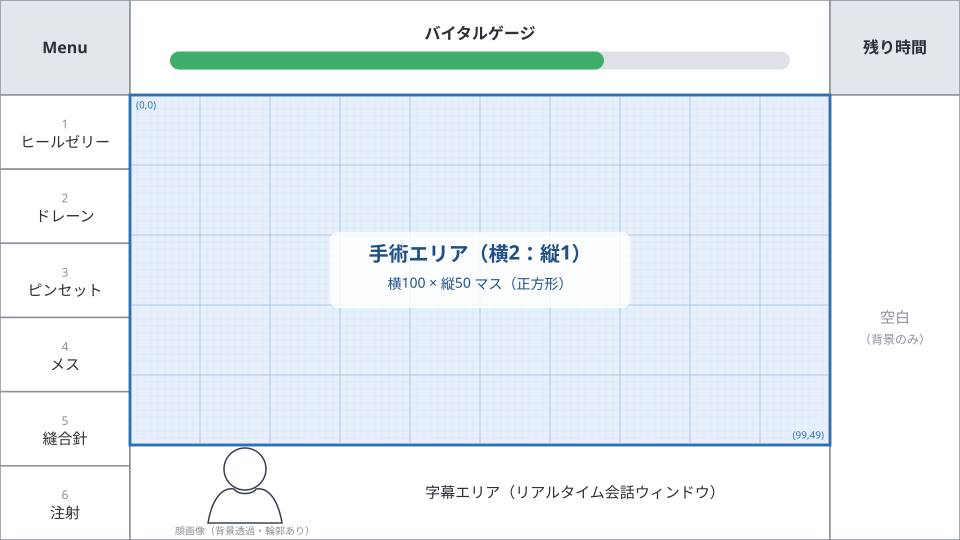

# 04 手術エリア

- ステータス：草案
- 最終更新：2026-10-03

> **この仕様書の書き方（04〜07 共通）**
> - 決定記録（`_records/` の R1〜R7、M1〜M35 など）で決まった内容は、そのまま本文に書く。
> - 決定記録に無い規則を読めるようにするため、仮に書いたものには **【仮案・未確認】** を付け、そのファイル末尾の未決事項に TBD として登録した。【仮案・未確認】の部分は、ユーザーの確認が済むまで決定として扱わない。
> - 数値は **決定値**（決定記録にある値）、**例**（説明用。決定ではない）、**未定**（TBD）を区別して書く。
> - 座標は、仕様全体で **[x, y]（横, 縦）** の順に書く。

## 1. グリッド

### 1.1 考え方（必須の仕様）

- 画面サイズや解像度によらず、**どの端末でも同じ条件で遊べる**ようにする。
- そのため、次の手順で手術エリアを決める。
  1. 内部解像度 1920×1080（16:9 固定）の画面の上下左右の端に、医療機器などの表示エリアを確保する。
  2. 残りの領域を **横2：縦1** の手術エリアにする。
  3. 手術エリアを**正方形のマス**に分割する。
- 画面比率を固定しているので、マスは常に正方形のまま保たれる（[01_overview.md](01_overview.md) 2.1）。
- **補足**：画面比率を端末に合わせて変えると、正方形のマスが長方形に変わり、当たり判定の感覚が端末ごとに変わってゲーム性が悪くなる。これを防ぐための仕様。

### 1.2 マス目

- 手術エリアを **横100 × 縦50 マス**（マス座標 [x, y] で x は 0〜99、y は 0〜49）に分割し、病巣をマス目上に配置する。
- 例（座標は [x, y]）：[50, 25]（ほぼ中央）に腫瘍を配置すると、そこに病巣が現れて治療対象の箇所になる。

### 1.3 画面の配置

- 左右の表示エリアは同じ幅にする（オプションで医療機器を左右入れ替えるため）。
- 各エリアの大きさは、画面全体を横1920×縦1080 とした**論理座標**（1.4）で表す。
- 図（SVG）は 960×540 の縮小版で、論理座標の半分の大きさで描いてある（図の値を2倍すると論理座標になる）。図の中のバイタルゲージの塗りや顔画像のシルエットは例示であり、仕様ではない。

| エリア | 位置 | 大きさ（論理座標） |
|---|---|---|
| 医療機器（Menu と6つの機器） | 左端（オプションで右端） | 幅 260 × 高さ 1080（Menu は上から高さ 180、その下に6つの機器を高さ 150 ずつ） |
| バイタルゲージ | 上端の中央 | 幅 1400 × 高さ 180 |
| 手術エリア | 中央 | 幅 1400 × 高さ 700（横2：縦1） |
| 字幕エリア（リアルタイム会話ウィンドウ） | 下端の中央 | 幅 1400 × 高さ 200。左側に話者の顔画像を背景透過で表示する。画像を囲む枠は付けず、人物シルエットには輪郭線を付ける。字幕はその右側に配置する。顔画像は立ち絵とは別の素材（決定、2026-10-03）。表示サイズは未決定（`TBD-04-7`） |
| 残り時間 | 医療機器の反対側の上端 | 幅 260 × 高さ 180 |
| 空白（背景のみ） | 医療機器の反対側（残り時間の下） | 幅 260 × 高さ 900。ピンセットで不要物を掴んでいる間は、ここにトレイを表示する（[05_instruments.md](05_instruments.md) 3.3）。テーピングのテープもここに出す（[05_instruments.md](05_instruments.md) 4.1）。どちらも枠外から出てくる演出つき |

- 手術エリアは横100×縦50マスで、1マスは論理座標で 14×14（100×14＝1400、50×14＝700）。
- 手術エリアの左上は論理座標 (260, 180)、右下は (1660, 880)。
- **薬ボタン**（注射を選んでいる間に出す薬の選択ボタン）は、注射アイコンの横（手術エリア側）に出し、薬の種類は上方向に並べる。専用の領域は取らず、手術エリア・字幕エリアなどに重なってよい。**最上位レイヤー**で描く（決定。[05_instruments.md](05_instruments.md) 3.6）。
- ピンセットで掴んでいる物も最上位レイヤーで描く（字幕エリア・バイタルゲージ・残り時間の上にも重なる。決定。05 3.3）。
- 医療機器の6つの機器の高さは **150**（決定、2026-10-03）。以前は Menu の下の高さ 890 を6等分すると割り切れなかったため、Menu を 190 から 180 に縮め、バイタルゲージ・残り時間も Menu に合わせて 180 にし、手術エリアを 10 上にずらした。下の字幕エリアは 190 から 200 に広がる。

#### 医療機器を右側にした場合（オプションの左右入れ替え）

- 左右の表示エリアは同じ幅（260）なので、**手術エリア・バイタルゲージ・字幕エリアの位置と、マス座標・論理座標の対応は変わらない**（手術エリアの左上は常に論理座標 (260, 180)）。
- 入れ替わるのは、医療機器の列（Menu と6つの機器）と、その反対側のエリア（残り時間と空白＝トレイ）。医療機器を右にすると、残り時間は左上、トレイは左側の空白エリアになる。
- バイタルゲージ・字幕エリア・顔画像は中央のままで、左右を反転しない（顔画像は字幕エリアの左側のまま）（決定、2026-10-03）。

### 1.4 座標の扱い

- **仕様とデータでは、画面の解像度を意識しない座標を使う。**

| 座標 | 使う場所 | 範囲 |
|---|---|---|
| マス座標 | 手術エリア内（病巣の位置、病巣のヒットエリア、通過点など） | 横 x：0〜99、縦 y：0〜49。**[x, y]（横, 縦）の順**。左上が [0, 0]、右下が [99, 49] |
| 論理座標 | 画面全体の配置（UI のエリアなど） | 横 0〜1920、縦 0〜1080（左上が (0, 0)） |

- 実装の方針（推奨）：プログラムはマス座標と論理座標だけで処理し、実際の画面の解像度に合わせるのは描画処理だけで行う。タッチ・クリックの位置は、逆に実際の画面の座標から論理座標・マス座標に変換して受け取る。
  - **補足**：ブラウザの Canvas では拡大縮小の変換を1か所で設定できるため、この方式は一般的で、無理なく採用できる見込み。

#### 論理座標とマス座標の変換

- マス [x, y]（整数）は、論理座標では次の正方形（14×14）になる。
  - 横：260 + 14×x 〜 260 + 14×(x+1)　縦：180 + 14×y 〜 180 + 14×(y+1)
- （決定、2026-10-03）タッチ・クリックの位置は小数を含む**実数のマス座標**に変換して扱う。データに書く整数の [x, y] は、そのマスの**中心**を表す。
  - 実数のマス座標 x ＝（論理座標の横 − 260）÷ 14 − 0.5、y ＝（論理座標の縦 − 180）÷ 14 − 0.5
  - 論理座標 (260, 180)（手術エリアの左上の角）は実数 [−0.5, −0.5]、マス [0, 0] の中心は論理座標 (267, 187)。
  - 手術エリアの中心＝論理座標 (960, 530) は実数のマス座標 [49.5, 24.5]（マス [49, 24] と [50, 25] の中間）。
  - 手術エリアの内側かどうかは、実数のマス座標が x は −0.5 以上 99.5 未満、y は −0.5 以上 49.5 未満であること。
- 変換の例（実際の画面の座標 → 論理座標 → マス座標）：画面の実際の大きさが 1280×720（0.667 倍）で、画面左上から (640, 360) の位置をタップした場合、論理座標は (640 ÷ 0.667, 360 ÷ 0.667) ＝ (960, 540)、マス座標は [49.5, 25.21]（手術エリアの中心より少し下）。
- 画面の縦横比が 16:9 でない端末では、左右または上下の余り（黒塗り）が生じる。論理座標の範囲（0〜1920、0〜1080）の外のタッチは無視する（決定、2026-10-03）。

## 2. 当たり判定

- **ヒットエリアは病巣側が持つ判定の範囲**（病巣の判定データ）のこと。医療機器側にはヒットエリアを持たない。
- 機器ごとの判定のしかた（操作した位置がヒットエリア内なら OK、ヒットエリアをすべて覆えば OK、通過点で判定するなど）は [05_instruments.md](05_instruments.md) 2.3。
- 病巣のヒットエリアに重ならない場所の操作は**空振り**になる。空振りの結果（ダメージ・回復・何も起きない）は機器ごとに決める（[05_instruments.md](05_instruments.md) 1.1）。
- 操作の位置は指（ポインタ）の位置のままにする（ずらさない）。操作中は、指のまわりに機器の範囲（筆の大きさ、吸い口など）を大きめに表示する（見た目だけで、判定には使わない。[05_instruments.md](05_instruments.md) 2.5）。
- 「○マス以内」の距離は、円（まっすぐな距離）で測る（[05_instruments.md](05_instruments.md) 2.4）。
- 距離の細部（決定、2026-10-03）：距離は実数のマス座標どうしのユークリッド距離（√(Δx²＋Δy²)）で測る。「N マス以内」は、距離が N **以下**（N ちょうどを含む）。通過点・ヒットエリアの中心などデータに書く整数座標は、マスの中心を表す。

### 見た目と判定データ

- 病巣は、**見た目**と**判定データ**を分けて持つ。

| 種類 | 内容 | 形式 |
|---|---|---|
| 見た目 | 画面に表示する病巣の絵 | 画像 |
| 判定データ | 治療の成否を判定するための形 | マス座標 [x, y]。ヒットエリア（範囲）、またはメス・縫合針で使う通過点のリスト（[05_instruments.md](05_instruments.md) 3.4・3.5） |

- 判定データの基本は、**座標そのものが形を表す**こと（例：小さい腫瘍なら、隣接する4点を四角形にする。決定の方向性。試作 v02 の P54 への回答、2026-10-02）。ただし、効率の面で良くない部分もあるため、記述形式は下の「ヒットエリアの記述形式」のとおり（決定、2026-10-03）。形は病巣の種類が持ち、位置は配置が持つ（決定、2026-10-03）。
- 判定データは、病巣の種類ごとに形（ヒットエリアの形・通過点の並び）を持ち、置く位置は配置（ステージデータ）で決める（[07_data_format.md](07_data_format.md) 2.1）。データに書く座標は、**配置の位置を [0, 0] とした相対座標**にする（決定、2026-10-03）。この章の例は、配置後の画面上の座標（絶対座標）で書く。
- 病巣の種類ごとの判定データの形は、病巣の再整理（テーマ3）で決める（`TBD-06-8`。旧 `TBD-04-3` を統合）。

### ヒットエリアの記述形式（決定、2026-10-03）

- ヒットエリアは、次の**図形のリスト**で書く（複数の図形を並べると、その和集合がヒットエリアになる）。マス単位の判定が必要な機器（ヒールゼリーの「覆ったか」など）では、**マスの中心がいずれかの図形の中にあるマス**をヒットエリアのマスとして数える。
- 図形は次の3つから始める（四角は使う見通しが無いため外した。四角い形は「マスの集まり」で書く。決定、2026-10-03）。必要になったら種類を増やす。

| 図形 | 書き方の例（JSON 風） | 使いどころの例 |
|---|---|---|
| 円 | `{"type":"circle","center":[50,25],"radius":2}` | 大きさのある点（腫瘍、血溜まりなど） |
| 太さのある線 | `{"type":"line","points":[[10,10],[20,12],[30,10]],"width":2}` | 切り傷、裂傷（線から `width` マス以内） |
| マスの集合 | `{"type":"cells","cells":[[10,10],[11,10],[11,11]]}` | 不規則な形、四角い形、破片痕（1マス） |

- 通過点（メス・縫合針）は、ヒットエリアとは別に、順番付きの座標のリストで持つ（例：`"path":[[0,0],[5,5],[10,10]]`。[05_instruments.md](05_instruments.md) 3.4・3.5）。病巣によってはヒットエリアと通過点の両方を持つ（例：切開は、消毒のヒールゼリー用のヒットエリアと、メス用の通過点）。
- 例：腫瘍のヒットエリアを `{"type":"cells","cells":[[49,24],[50,24],[51,24],[49,25],[50,25],[51,25],[49,26],[50,26],[51,26]]}`（x が 49〜51、y が 24〜26 の 3×3 マス）とする。

### 例：特定の病巣用の注射

- 上の腫瘍に、特定の病巣用の薬を打つ場合。[49, 24]（ヒットエリアの左上のマス）を押すと、ヒットエリア内なので「その病巣への操作」となり、押している間、ゲージを消費して注入できる（必要量を入れると成功し、病巣の手順が1段進む。[05_instruments.md](05_instruments.md) 3.6）。[48, 23] を押すと、ヒットエリアの外なので空振り（ダメージ 1、注入しない）になる。

## 3. 患者の表現

### 3.1 背景

- 背景は患者（クランケ）の画像。
- 外傷の場合は普通の人物絵。体内の場合は本家にならい、青を基調とした記号的な表現にする。

### 3.2 呼吸・拍動のアニメーション

- 患者が生きていること（呼吸や拍動）を表すため、一定のテンポで背景をアニメーションさせる。そのため、最低3枚の画像が必要。
- アニメーションで術野がずれるとゲーム性が悪くなるので、拍動によるずれは最小限にする。
- 術野は移動しない（ギルス系は別とする。名称は `TBD-04-5`）。

### 3.3 テンポ

バイタルによってテンポが変わる。

| 状態 | テンポ | ゲージの色 |
|---|---|---|
| バイタル 51〜99 | 通常 | 緑 |
| バイタル 26〜50 | 早い | 黄 |
| バイタル 1〜25 | 危険域 | 赤 |
| 麻酔有効時 | 遅い（バイタルに関係なく） | バイタルに従う |

- 麻酔が効いている間はバイタルの減少も緩やかになる（[03_game_rules.md](03_game_rules.md) 1.3）。

- 各テンポの具体値（1拍の秒数）は `TBD-04-4`。

## 4. 未決事項

| ID | 内容 | 提案ID |
|---|---|---|
| ~~TBD-04-3~~ | **統合済み**：病巣の種類ごとの判定データの形は `TBD-06-8` で扱う（ヒットエリアと通過点のリストを使うことは決定済み） | D4 |
| TBD-04-4 | 各テンポの具体値 | - |
| TBD-04-5 | 「ギルス系」（本家の用語）の名称（採否はユーザーが決める）と仕様 | A3 |
| TBD-04-7 | 字幕エリアの話者の顔画像の表示サイズ（字幕エリアの高さ 200 に対する大きさ、字幕の開始位置）。※顔画像は立ち絵とは別素材と決定（2026-10-03） | - |
| ~~TBD-04-8~~ | **決定（2026-10-03）**：実数のマス座標で扱い、整数の [x, y] はマスの中心。距離はユークリッド距離で、「N 以内」は N 以下（1.4、2章） | - |
| ~~TBD-04-9~~ | **決定（2026-10-03）**：ヒットエリアは、円・太さのある線・マスの集合の3つの図形のリストで書く（四角は外した）（2章） | - |
| ~~TBD-04-10~~ | **決定（2026-10-03）**：手術エリアの位置・座標の対応は変えず、機器の列と残り時間・トレイの側だけ入れ替える。バイタルゲージ・字幕エリア・顔画像は反転しない | - |
| ~~TBD-04-11~~ | **決定（2026-10-03）**：6つの機器の高さは 150。Menu・バイタルゲージ・残り時間は 180、手術エリアは (260, 180)〜(1660, 880)、字幕エリアは 200。論理座標の範囲外のタッチは無視する（1.3、1.4） | - |

- 欠番（解決済み・再利用しない）：04-1、04-2、04-6。
