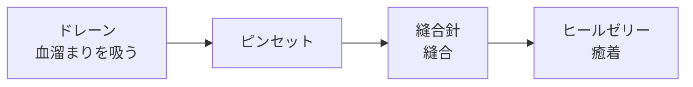

# 06 病巣

- ステータス：草案（作成途中。病巣の再整理（テーマ3）で整理し直す。）
- 最終更新：2026-10-03

> **この章の読み方**
> - 各項目の末尾の印：**確定**＝memo または決定記録（M1〜M35 など）にある内容。**暫定**＝仮に書いた内容で、病巣の再整理（テーマ3）で決める（`TBD-06-8`）。**【仮案・未確認】**＝決定記録に無い規則を読めるように仮に書いたもの（末尾の未決事項に TBD を登録）。
> - 座標は [x, y]（横, 縦）の順（[04_surgery_area.md](04_surgery_area.md) 1.4）。
> - 用語：病巣の治療手順の中の1つを「**手順の段階**」と呼ぶ。ステージ内の区切りである「ステップ」（[07_data_format.md](07_data_format.md) 5.1）とは別（[glossary.md](glossary.md)）。

## 1. 共通ルール

- 病巣は重ならない。（確定）ただし、次は例外（決定、2026-10-03。3.2、3.6）：血溜まり・膿は**独立した病巣**（種類「血溜まり」「膿」。手順はドレーンだけ）として配置し、ほかの血溜まりやほかの病巣に重なってよい。メスの空振りで出る小さな切り傷は、ほかの病巣と重ねて出す。
- 各病巣は治療手順（医療機器を使う順番。1つ1つが手順の段階）を持つ。（確定）
- 手順を間違えたとき、最初に戻るタイプと戻らないタイプがある（どの病巣がどちらのタイプかはテーマ3で決める）。（確定。区分は未決）
  - 決定（2026-10-03）：最初に戻るのは、機器の結果が**「失敗」**のときだけ。無効・空振り・手順違いによる無効では戻らない。「戻る」は手順の段階を最初に戻すことで、血溜まりの量などは戻さない。
- 成功時の回復値と失敗時のダメージ値を持つ。（確定。値は `TBD-06-8`）
- 病巣があるあいだのバイタル減少（間隔と量）を持つ。病巣ごとに独立したタイマーで処理する（[03_game_rules.md](03_game_rules.md)）。（確定）
- 流血や膿がある状態ではヒールゼリーが効かない（無効）。（確定）
- **血溜まり・膿が重なっている病巣は、ドレーンで吸い切るまで、ドレーン以外の操作がすべて無効**（ダメージなし）。病巣の一部でも重なっていれば対象。メスの空振りで出た小さな切り傷が血溜まりの上にある場合も同じ。再出血で血溜まりが戻れば、処置の途中の病巣もまた止まる（決定、2026-10-03。重なった場所の操作の決まりは [05_instruments.md](05_instruments.md) 2.1）。
- 病巣は1つ100点満点で採点し、治療の完了時に評価（Cool／Good／Fine／Bad）を表示する。点数の条件（時間・ミスが無い・省略しない）の値は病巣データに持つ（[03_game_rules.md](03_game_rules.md) 5.1）。
- テーピング（特別機器）で終わる治療は、テーピングを病巣データの治療手順の1段階として書く（例：縫合針 → ヒールゼリー（省略可）→ テーピング。[05_instruments.md](05_instruments.md) 4.1）。（確定、2026-10-03）
- データ形式は [07_data_format.md](07_data_format.md) 参照。

## 2. 病巣一覧

- 「判定データ」は、治療の成否を判定するための形（見た目は別に画像として持つ。[04_surgery_area.md](04_surgery_area.md) 2章）。「ヒットエリア」「通過点」の書き方は [04_surgery_area.md](04_surgery_area.md) 2章（円・太さのある線・マスの集まり。決定、2026-10-03）。基本は**座標そのものが形を表す**（例：小さい腫瘍＝隣接する4マスの集まり）。
- 識別文字は、全種類が出そろってから考え直す（`TBD-06-5`）。
- 切開は、今は病巣の一種として扱っている（**暫定**。総称を「処置対象」にするかは `TBD-06-1`）。

| 病巣 | 分類 | 識別文字 | 形状 | 判定データの形（暫定） | 治療手順（手順の段階の順） | 状態 |
|---|---|---|---|---|---|---|
| 切り傷 | 外傷：軽症 | a | 長い線 | ヒットエリア：太さのある線 | ① ヒールゼリー | 形状・手順は確定、判定データは暫定 |
| 裂傷 | 外傷：重症 | TBD | 厚みを持った線 | ヒットエリア：太さのある線（ドレーン・ヒールゼリー用）、通過点（縫合針用） | ① ドレーン → ② ピンセット → ③ 縫合針 → ④ ヒールゼリー | 手順は確定（②の中身は `TBD-06-8`）、判定データは暫定 |
| 破片痕 | 外傷 | TBD | 点 | ヒットエリア：マスの集合（1マス）または小さな円 | ① ピンセット → ② ヒールゼリー | 形状・手順は確定、判定データは暫定 |
| 腫瘍 | 外傷 | TBD | 大きさのある点 | ヒットエリア：マスの集合または円（ドレーン・ヒールゼリー用）、通過点：円形（メス用） | 未決（`TBD-06-2`） | 手順は未決 |
| 切開 | - | TBD | 長い線 | ヒットエリア：太さのある線（消毒のヒールゼリー用）、通過点：線状（メス用） | ① ヒールゼリー（省略可）→ ② メス | 手順は確定、判定データは暫定 |
| 小さな切り傷（メスの空振りで発生） | 外傷：軽症 | TBD | 短い線 | 切った軌跡から作る（3.6） | ① ヒールゼリー | 確定（M17、P42。3.6） |

- 「物」（破片・ごみ・異物・血管など、ピンセットで動かす物）も病巣の一種として扱う（[05_instruments.md](05_instruments.md) 3.2・3.3）。種類としての一覧は、病巣の再整理（テーマ3）で作る（`TBD-06-8`、`TBD-06-6`）。
- 医療機器側の決定は [05_instruments.md](05_instruments.md) に反映済み（メスの空振りで発生する「小さな切り傷」、物も病巣の一種としてドレーンの対象を病巣ごとに決めること、ドレーンで吸う量・自然増・最大値、ピンセットの運び先など）。それらの値を病巣ごとに整理するのがテーマ3。

## 3. 各病巣の仕様

### 3.1 切り傷（外傷：軽症）

| 項目 | 内容 | 状態 |
|---|---|---|
| 形状 | 長い線 | 確定 |
| 判定データ | ヒットエリア（太さのある線） | 暫定 |
| 治療手順 | ① ヒールゼリー（線をしきい値（例：80%）以上覆う。[05_instruments.md](05_instruments.md) 3.1） | 確定 |
| 回復値・ダメージ値・バイタル減少 | 値は未定（`TBD-06-8`） | 未決 |

### 3.2 裂傷（外傷：重症）

| 項目 | 内容 | 状態 |
|---|---|---|
| 形状 | 厚みを持った線 | 確定 |
| 判定データ | ヒットエリア（太さのある線）と、縫合針用の通過点 | 暫定 |
| 治療手順 | ① ドレーン（血溜まりを吸う）→ ② ピンセット → ③ 縫合針（縫合）→ ④ ヒールゼリー（癒着）。① は「裂傷に重なっている血溜まり（独立した病巣）を吸い切る」に置き換わる（決定、2026-10-03。書き方はテーマ3） | 手順は確定。② ピンセットは**開いた傷口を寄せて、縫いやすくするための処置**（決定、2026-10-03。試作 v03 の P65 への回答）。操作のしかた（どこを掴んでどこへ寄せるか）は `TBD-06-8`（試作 v01 の P8、試作 v02 の P56。scenario.md のステージ1は「ドレーン → 縫合 → ゼリー」） |
| 血溜まり | 血溜まりができる。血溜まりはドレーンで吸い出せる。血溜まりは病巣の「量」（自然増・最大値を持つ。[05_instruments.md](05_instruments.md) 3.2）で表す。**出血は1つの長いエリアではなく、複数の血溜まりで表す**。血溜まりどうしは重なってもよく、重なった場所では2つ以上を同時に吸える。**血溜まりは量に応じて広がる**。血溜まりは裂傷の中の値ではなく、**独立した病巣**として裂傷に重ねて配置する（決定、2026-10-03。広がり方の細部はテーマ3） | 確定 |
| 再出血 | 一定時間後に出血して、再び血溜まりができる。これは「量が自然増で0から再び増える」ことと同じ現象として扱い、別の仕組みは作らない（決定、2026-10-03。時間は `TBD-06-8`） | 確定（時間は `TBD-06-8`） |

### 3.3 破片痕（外傷）

| 項目 | 内容 | 状態 |
|---|---|---|
| 形状 | 点 | 確定 |
| 判定データ | ヒットエリア（マスの集合または小さな円） | 暫定 |
| 治療手順 | ① ピンセット（掴んでトレイへ運ぶ。[05_instruments.md](05_instruments.md) 3.3）→ ② ヒールゼリー | 確定 |

- scenario.md のステージ1の文言（「掴んで画面外に出す」）は旧仕様。新仕様は「掴んでトレイへ運ぶ」（[07_data_format.md](07_data_format.md) 5.4 の注記）。

### 3.4 腫瘍（外傷）

| 項目 | 内容 | 状態 |
|---|---|---|
| 形状 | 大きさのある点 | 確定 |
| 判定データ | ヒットエリア（マスの集合または円）と、メス用の円形の通過点（腫瘍の周りを切る） | 暫定 |
| 条件 | 膿を吸い出さないと治療できない（ドレーンを使う） | 確定 |
| 治療手順 | 摘出前にヒールゼリーを生理食塩水の代わりに使う。治療手順の全体は `TBD-06-2` | 一部確定、全体は未決 |

### 3.5 切開

| 項目 | 内容 | 状態 |
|---|---|---|
| 形状 | 長い線。メスで切開する箇所 | 確定 |
| 判定データ | **通過点の座標のリスト**（例：`[0,0]` `[5,5]` `[10,10]`）。判定方法は確定済み（[05_instruments.md](05_instruments.md) 3.4）。消毒のヒールゼリー用にヒットエリアも持つ | 通過点の判定は確定、ヒットエリアは暫定 |
| 治療手順 | ① ヒールゼリー（省略可）→ ② メス | 確定 |

| 状況 | 結果 | 状態 |
|---|---|---|
| メスで失敗 | ダメージ | 確定 |
| ヒールゼリーを省略 | メスで成功してもダメージ **1**（病巣データの値。決定。試作 v02 の P43 への回答、2026-10-02）。ミスの数には数えず、省略をプレイヤーに伝える表示も出さない。病巣の点数では「手順の省略をしない」の条件で減点される（[03_game_rules.md](03_game_rules.md) 5.1）。省略は手順違いではなく省略として扱う（[05_instruments.md](05_instruments.md) 2.2。決定、2026-10-03） | 確定 |

### 3.6 小さな切り傷（メスの空振りで発生）

- メスで病巣の無い場所をなぞって空振りしたとき、**切った場所に発生する病巣**（確定。M17）。ヒールゼリーだけで治る。
- 実行時に発生する病巣で、ステージデータに配置を書かない（[07_data_format.md](07_data_format.md) 4章）。**ほかの病巣と重なる場所にも発生させる**（決定、2026-10-03。以前は「重なる場所には発生させない」だった）。
- 決定（試作 v02 の P42・P60 への回答、2026-10-02）：
  - 形：切った軌跡を間引いた折れ線を判定データにし、ヒットエリアは線から1マス以内。長さの上限は例：10マス。
  - 手術エリアの端：はみ出す部分は切り捨てる。ほかの病巣とは重なってよい（重なった場所の操作は [05_instruments.md](05_instruments.md) 2.1）。
  - 手順はヒールゼリーのみ。バイタル減少は持たない。
  - **治療は「要」**：治さないとステップを終えられない。ステップ完了条件（全病巣完了）に**含める**（以前の仮案「含めない」を取り消した）。
  - 長さの上限などの具体値は例（`TBD-05-11` と合わせて調整）。

## 4. 未決事項

| ID | 内容 | 提案ID |
|---|---|---|
| TBD-06-1 | 「切開」を病巣に含めるか（総称を「処置対象」にするか）。今は病巣として扱っている（暫定） | F1 |
| TBD-06-2 | 腫瘍の治療手順 | F2 |
| ~~TBD-06-3~~ | **決定（2026-10-03）**：戻るのは機器の結果が「失敗」のときだけ（無効・空振りでは戻らない）。戻すのは手順の段階だけで、量などは戻さない（1章）。どの病巣が戻るタイプかはテーマ3 | F3 |
| TBD-06-5 | 識別文字（英単語 ID にするか） | F5 |
| TBD-06-6 | 皮膚の中の異物（scenario.md ステージ1）の定義 | F6 |
| TBD-06-8 | 病巣の再整理（テーマ3）：病巣ごとの判定データ（ヒットエリア・通過点。旧 `TBD-04-3` を統合）と治療手順、回復値・ダメージ値・バイタル減少量（旧 `TBD-06-7` を統合）、時間による変化（再出血などの秒数と量の自然増との対応。旧 `TBD-06-4` を統合）、吸い出す量・自然増・最大値、運び先、裂傷のピンセットの意味（試作 v01 の P8、試作 v02 の P56）、どの病巣が「失敗で最初に戻る」タイプか（`TBD-06-3` の残り）、血溜まり・膿の広がり方（独立した病巣として持つことは決定） | D3 |
| ~~TBD-06-9~~ | **決定済み（2026-10-02）**：メスの空振りで出る「小さな切り傷」の定義は 3.6 に反映（試作 v02 の P42・P60）。ステップ完了条件に含める。元の仮案：切った軌跡を間引いた折れ線を判定データにし、ヒットエリアは線から1マス以内。長さの上限は例：10マス。ほかの病巣のヒットエリアと1マスでも重なる位置・手術エリアの外にはみ出す部分は発生させない（はみ出す場合は切り捨て）。手順はヒールゼリーのみ。バイタル減少は持たない（完了条件の扱いのみ変更：含める）。理由：空振りのたびに作業が増えて重くならないようにする | - |

- 欠番（解決済み・統合・再利用しない）：06-9（小さな切り傷。3.6 に反映）、06-4（再出血などの秒数）と 06-7（回復値・ダメージ値・減少量）は 06-8 に統合。
