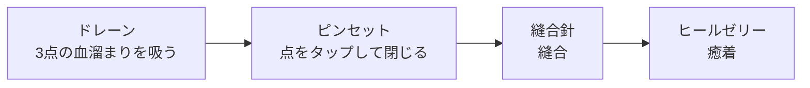

# 06 病巣

- ステータス：草案（作成途中。病巣の再整理（テーマ3）の途中。2026-10-10 にユーザーの整理結果（途中）を反映した。追加の病巣と細部は次回）
- 最終更新：2026-10-10

> **この章の読み方**
> - 各項目の末尾の印：**確定**＝memo または決定記録（M1〜M35 など）にある内容。**暫定**＝仮に書いた内容で、病巣の再整理（テーマ3）で決める（`TBD-06-8`）。**【仮案・未確認】**＝決定記録に無い規則を読めるように仮に書いたもの（末尾の未決事項に TBD を登録）。「2026-10-10」とだけ書いたものは、その日のユーザーの整理結果（途中。名称も含めて変わることがある）。
> - 座標は [x, y]（横, 縦）の順（[04_surgery_area.md](04_surgery_area.md) 1.4）。
> - 用語：病巣の治療手順の中の1つを「**手順の段階**」と呼ぶ。ステージ内の区切りである「ステップ」（[07_data_format.md](07_data_format.md) 5.1）とは別（[glossary.md](glossary.md)）。

## 1. 共通ルール

- **病巣は重なってよい**（決定、2026-10-10。以前の「病巣は重ならない（血溜まり・膿と小さな切り傷だけ例外）」から変更）。重なった場所を押したときの操作の決まりは [05_instruments.md](05_instruments.md) 2.1（血溜まり・膿が重なっている病巣はドレーン以外無効、それ以外は今の段階に合う病巣 → あとから出た病巣の順で優先）。
- **病巣は、それ単体の症状として定義する**（決定、2026-10-10）。
- **病巣を組み合わせて出す場合がある**（決定、2026-10-10）。例：腫瘍の前に膿が出ていることがある。組み合わせの書き方は `TBD-06-10`。
- 病巣の名称は、ある程度本物に準じたい。あとで変えることがある（2026-10-10）。
- 各病巣は治療手順（医療機器を使う順番。1つ1つが手順の段階）を持つ。（確定）
- 手順を間違えたとき、最初に戻るタイプと戻らないタイプがある（どの病巣がどちらのタイプかはテーマ3で決める）。（確定。区分は未決）
  - 決定（2026-10-03）：最初に戻るのは、機器の結果が**「失敗」**のときだけ。無効・空振り・手順違いによる無効では戻らない。「戻る」は手順の段階を最初に戻すことで、血溜まりの量などは戻さない。
- 成功時の回復値と失敗時のダメージ値を持つ。（確定。値は `TBD-06-8`）
- 病巣があるあいだのバイタル減少（間隔と量）を持つ。病巣ごとに独立したタイマーで処理する（[03_game_rules.md](03_game_rules.md)）。（確定）
- 流血や膿がある状態ではヒールゼリーが効かない（無効）。（確定）
- **血溜まり・膿が重なっている病巣は、ドレーンで吸い切るまで、ドレーン以外の操作がすべて無効**（ダメージなし）。病巣の一部でも重なっていれば対象。メスの空振りで出た小さな切り傷が血溜まりの上にある場合も同じ。再出血で血溜まりが戻れば、処置の途中の病巣もまた止まる（決定、2026-10-03。重なった場所の操作の決まりは [05_instruments.md](05_instruments.md) 2.1）。
- 病巣は1つ100点満点で採点し、治療の完了時に評価（Cool／Good／Fine／Bad）を表示する。点数の条件（時間・ミスが無い・省略しない）の値は病巣データに持つ（[03_game_rules.md](03_game_rules.md) 5.1）。
- テーピング（特別機器）で終わる治療は、テーピングを病巣データの治療手順の1段階として書く（例：縫合針 → ヒールゼリー（省略可）→ テーピング。[05_instruments.md](05_instruments.md) 4.1）。（確定、2026-10-03）テーピングは手術完了の証として最後にだけ出て、ほかの病巣と同時に出ない（決定、2026-10-10）。
- データ形式は [07_data_format.md](07_data_format.md) 参照。

## 2. 病巣一覧

- 「判定データ」は、治療の成否を判定するための形（見た目は別に画像として持つ。[04_surgery_area.md](04_surgery_area.md) 2章）。「ヒットエリア」「通過点」の書き方は [04_surgery_area.md](04_surgery_area.md) 2章（円・太さのある線・マスの集まり。決定、2026-10-03）。基本は**座標そのものが形を表す**（例：小さい腫瘍＝隣接する4マスの集まり）。
- 以前の表にあった「分類」（外傷：軽症など）と「識別文字」（切り傷は a など）は、使っていないので削除した（2026-10-10 ユーザー指示）。
- 切開は、今は病巣の一種として扱っている（**暫定**。総称を「処置対象」にするかは `TBD-06-1`）。
- 下の表は 2026-10-10 のユーザーの整理結果（途中）。**新しい操作・仕組みが要る病巣**（表の「新しい仕組み」の列）は、医療機器の仕様（[05_instruments.md](05_instruments.md)）にはまだ反映していない（`TBD-06-11`）。試作 v04 も以前の病巣のまま。

| 病巣 | 座標（判定データ） | 治療手順（手順の段階の順） | 新しい仕組み | 状態 |
|---|---|---|---|---|
| 切り傷 | 長い線（ヒットエリア：太さのある線） | ① ヒールゼリー | - | 仕様OK（2026-10-10） |
| 裂傷 | 3点以上の点 | ① ドレーン（3点それぞれに出る血溜まりを吸う）→ ② ピンセット（点をタップして患部を閉じる）→ ③ 縫合針 → ④ ヒールゼリー | ピンセットで点をタップして閉じる | 2026-10-10 |
| 破片痕 | 点（ヒットエリア：1マスまたは小さな円） | ① ピンセット（トレイへ運ぶ）→ ② ヒールゼリー | - | 仕様OK（2026-10-10） |
| 大型破片痕 | 1点（2点以上の場合もある） | ① メス（点ごとに1つずつ切開）→ ② ピンセット（除去）→ ③ ピンセット（患部を閉じる。裂傷と同じ）→ ④ ヒールゼリー | 点を切開するメス、ピンセットで閉じる | 2026-10-10 |
| 血溜まり・膿 | 1点以上の点（そこを中心に出血・膿が出ている） | ① ドレーン（これだけで治る） | - | 2026-10-10 |
| 切開 | 長い線（通過点：線状。消毒用のヒットエリア） | ① ヒールゼリー（省略可）→ ② メス | - | 仕様OK（2026-10-10） |
| 小さな切り傷（メスの空振りで発生） | 切った軌跡から作る（3.7） | ① ヒールゼリー | - | OK（2026-10-10） |
| 血腫・粉瘤 | 点 | ① メス（当てると血・膿が広がる）→ ② ドレーン → ③ ヒールゼリー | 点を切開するメス、切開で血・膿が出る | 2026-10-10 |
| 腫瘍 | 円形に並んだ8つの点 | ① メス（切除）→ ② ピンセット（除去）→ ③ ピンセット（中心をつまむ。穴をふさぐ）→ ④ 縫合針 → ⑤ ヒールゼリー | ピンセットでつまむ | 2026-10-10 |
| 血管接合 | 2点（A点・B点） | ① ピンセット（血管を持ち上げて繋ぐ。A→B または B→A）→ ② 縫合針 | 2点を繋ぐピンセット | 2026-10-10 |
| 注射投薬 | 1点 | ① 注射（指定の薬を患部に注入。それだけで完了） | -（今の「特定の病巣用の薬」と同じ） | 2026-10-10 |
| マイクロマシン（丸形） | 出現地点 | 移動する。① ヒールゼリー（足止め）→ ② ピンセット（除去） | 移動する病巣、ヒールゼリーの足止め | 2026-10-10 |
| マイクロマシン（線形） | 出現地点 | 移動する。内部にいる。① メス（表に出す）→ ② ピンセット（除去） | 移動する病巣、メスで表に出す | 2026-10-10 |
| マイクロマシン（大型） | 出現地点 | 移動する。① メス（攻撃。数回）→ ② 注射（傷が付いたらそこに注入）→ ③ ピンセット（除去） | 移動する病巣、メスで数回攻撃、傷に注射 | 2026-10-10 |

- 「物」（破片・ごみ・異物・血管など、ピンセットで動かす物）も病巣の一種として扱う（[05_instruments.md](05_instruments.md) 3.2・3.3）。
- 医療機器側の決定は [05_instruments.md](05_instruments.md) に反映済み（メスの空振りで発生する「小さな切り傷」、ドレーンで吸う量・自然増・最大値、ピンセットの運び先など）。それらの値を病巣ごとに整理するのがテーマ3。

## 3. 各病巣の仕様

### 3.1 切り傷

| 項目 | 内容 | 状態 |
|---|---|---|
| 形状 | 長い線 | 確定 |
| 判定データ | ヒットエリア（太さのある線） | 暫定 |
| 治療手順 | ① ヒールゼリー（線をしきい値（例：80%）以上覆う。[05_instruments.md](05_instruments.md) 3.1） | 確定 |
| 回復値・ダメージ値・バイタル減少 | 値は未定（`TBD-06-8`） | 未決 |

### 3.2 裂傷

| 項目 | 内容 | 状態 |
|---|---|---|
| 判定データ | **3点以上の点**を座標として持つ。縫合針用の通過点との関係は `TBD-06-11` | 2026-10-10 |
| 治療手順 | ① ドレーン → ② ピンセット → ③ 縫合針（縫合）→ ④ ヒールゼリー（癒着） | 確定 |
| ① ドレーン | **3点それぞれに血溜まりが出て**、それをドレーンで吸う（2026-10-10）。血溜まりは独立した病巣として裂傷に重なる。量（自然増・最大値を持つ。[05_instruments.md](05_instruments.md) 3.2）で表し、量に応じて広がる。血溜まりどうしは重なってもよく、重なった場所では2つ以上を同時に吸える（決定、2026-10-03） | 2026-10-10 |
| ② ピンセット | 通常の使い方（物の移動）ではなく、**その点をタップして患部を閉じる**（2026-10-10。意味は「開いた傷口を寄せて縫いやすくする処置」。決定、2026-10-03。試作 v03 の P65）。細部は `TBD-06-11` | 2026-10-10 |
| ③ 縫合針・④ ヒールゼリー | 通常どおりの使い方（[05_instruments.md](05_instruments.md) 3.5・3.1） | 2026-10-10 |
| 再出血 | 一定時間後に出血して、再び血溜まりができる。これは「量が自然増で0から再び増える」ことと同じ現象として扱い、別の仕組みは作らない（決定、2026-10-03。時間は `TBD-06-8`） | 確定（時間は `TBD-06-8`） |

### 3.3 破片痕

| 項目 | 内容 | 状態 |
|---|---|---|
| 形状 | 点 | 確定 |
| 判定データ | ヒットエリア（マスの集合または小さな円） | 暫定 |
| 治療手順 | ① ピンセット（掴んでトレイへ運ぶ。[05_instruments.md](05_instruments.md) 3.3）→ ② ヒールゼリー | 確定 |

- scenario.md のステージ1の文言（「掴んで画面外に出す」）は旧仕様。新仕様は「掴んでトレイへ運ぶ」（[07_data_format.md](07_data_format.md) 5.4 の注記）。

### 3.4 大型破片痕（2026-10-10）

| 項目 | 内容 |
|---|---|
| 判定データ | 座標1点。2点以上ある場合もある |
| 治療手順 | ① メスで切開（点ごとに1つずつ）→ ② ピンセットで除去 → ③ ピンセットで患部を閉じる（裂傷と同じ）→ ④ ヒールゼリーで終了 |

### 3.5 血溜まり・膿

| 項目 | 内容 |
|---|---|
| 判定データ | 1点以上の座標を持ち、それを中心に出血（膿）が出ている（2026-10-10） |
| 治療手順 | ① ドレーン（ドレーンだけで治る） |
| 決定済みの前提 | 独立した病巣として、ほかの病巣に重なってよい。量（自然増・最大値）を持ち、量に応じて広がる。重なった血溜まりは同時に吸える（決定、2026-10-03。[05_instruments.md](05_instruments.md) 3.2）。点を複数持つときの持ち方は `TBD-06-11` |

### 3.6 切開

| 項目 | 内容 | 状態 |
|---|---|---|
| 形状 | 長い線。メスで切開する箇所。開腹などを指す（内臓の治療に移る。2026-10-10） | 確定 |
| 判定データ | **通過点の座標のリスト**（例：`[0,0]` `[5,5]` `[10,10]`）。判定方法は確定済み（[05_instruments.md](05_instruments.md) 3.4）。消毒のヒールゼリー用にヒットエリアも持つ | 通過点の判定は確定、ヒットエリアは暫定 |
| 治療手順 | ① ヒールゼリー（省略可）→ ② メス | 確定 |

| 状況 | 結果 | 状態 |
|---|---|---|
| メスで失敗 | ダメージ | 確定 |
| ヒールゼリーを省略 | メスで成功してもダメージ **1**（病巣データの値。決定。試作 v02 の P43 への回答、2026-10-02）。ミスの数には数えず、省略をプレイヤーに伝える表示も出さない。病巣の点数では「手順の省略をしない」の条件で減点される（[03_game_rules.md](03_game_rules.md) 5.1）。省略は手順違いではなく省略として扱う（[05_instruments.md](05_instruments.md) 2.2。決定、2026-10-03） | 確定 |

### 3.7 小さな切り傷（メスの空振りで発生）

- メスで病巣の無い場所をなぞって空振りしたとき、**切った場所に発生する病巣**（確定。M17）。ヒールゼリーだけで治る。
- 実行時に発生する病巣で、ステージデータに配置を書かない（[07_data_format.md](07_data_format.md) 4章）。**ほかの病巣と重なる場所にも発生させる**（決定、2026-10-03）。
- 決定（試作 v02 の P42・P60 への回答、2026-10-02）：
  - 形：切った軌跡を間引いた折れ線を判定データにし、ヒットエリアは線から1マス以内。長さの上限は例：10マス。
  - 手術エリアの端：はみ出す部分は切り捨てる。ほかの病巣とは重なってよい（重なった場所の操作は [05_instruments.md](05_instruments.md) 2.1）。
  - 手順はヒールゼリーのみ。バイタル減少は持たない。
  - **治療は「要」**：治さないとステップを終えられない。ステップ完了条件（全病巣完了）に**含める**（以前の仮案「含めない」を取り消した）。
  - 長さの上限などの具体値は例（`TBD-05-11` と合わせて調整）。

### 3.8 血腫・粉瘤（2026-10-10）

| 項目 | 内容 |
|---|---|
| 状態 | 血（膿）がたまった状態 |
| 判定データ | 点 |
| 治療手順 | ① メス（当てると血（膿）が広がる）→ ② ドレーン → ③ ヒールゼリー |

### 3.9 腫瘍（2026-10-10）

| 項目 | 内容 |
|---|---|
| 判定データ | 8つの点が円形に並ぶ（メスの円形の通過点。[05_instruments.md](05_instruments.md) 3.4） |
| 治療手順 | ① メスで切除 → ② ピンセットで除去 → ③ 中心をピンセットでつまむ（穴をふさぐイメージ）→ ④ 縫合針 → ⑤ ヒールゼリー |
| 組み合わせ | 腫瘍の前に膿が出ていることがある（1章の「病巣を組み合わせて出す」） |

- 以前の記述（「膿を吸い出さないと治療できない」「摘出前にヒールゼリーを生理食塩水の代わりに使う」）は、この整理で置き換えた（膿は組み合わせで表す）。

### 3.10 血管接合（2026-10-10）

| 項目 | 内容 |
|---|---|
| 判定データ | 2点（A点・B点） |
| 治療手順 | ① ピンセットで血管を持ち上げて繋ぐ（A→B または B→A）→ ② 縫合針 |

### 3.11 注射投薬（2026-10-10）

| 項目 | 内容 |
|---|---|
| 判定データ | 1点 |
| 治療手順 | ① 指定の注射薬を患部に注入する（それだけで完了。[05_instruments.md](05_instruments.md) 3.6 の「特定の病巣用の薬」） |

### 3.12 マイクロマシン（2026-10-10）

3種類とも、座標は**出現地点**で、出現後に**移動する**。

| 種類 | 治療手順 |
|---|---|
| 丸形 | ① ヒールゼリーで足止め → ② ピンセットで除去 |
| 線形 | 内部にいる。① メスで表に出現させる → ② ピンセットで除去 |
| 大型 | ① メスで攻撃（数回）→ ② 傷が付いたらそこに注射 → ③ ピンセットで除去 |

## 4. 未決事項

| ID | 内容 | 提案ID |
|---|---|---|
| TBD-06-1 | 「切開」を病巣に含めるか（総称を「処置対象」にするか）。今は病巣として扱っている（暫定） | F1 |
| ~~TBD-06-2~~ | **決定（2026-10-10）**：腫瘍の治療手順は メス（切除）→ ピンセット（除去）→ ピンセット（中心をつまむ）→ 縫合針 → ヒールゼリー（3.9） | F2 |
| ~~TBD-06-3~~ | **決定（2026-10-03）**：戻るのは機器の結果が「失敗」のときだけ（無効・空振りでは戻らない）。戻すのは手順の段階だけで、量などは戻さない（1章）。どの病巣が戻るタイプかはテーマ3 | F3 |
| ~~TBD-06-5~~ | **削除（2026-10-10）**：識別文字は使っていないので削除した（2章） | F5 |
| TBD-06-6 | 皮膚の中の異物（scenario.md ステージ1）の定義。2026-10-10 の一覧のどれに当たるか（例：大型破片痕） | F6 |
| TBD-06-8 | 病巣の再整理（テーマ3）：病巣ごとの判定データ（ヒットエリア・通過点。旧 `TBD-04-3` を統合）と治療手順、回復値・ダメージ値・バイタル減少量（旧 `TBD-06-7` を統合）、時間による変化（再出血などの秒数と量の自然増との対応。旧 `TBD-06-4` を統合）、吸い出す量・自然増・最大値、運び先、どの病巣が「失敗で最初に戻る」タイプか（`TBD-06-3` の残り）、血溜まり・膿の広がり方（独立した病巣として持つことは決定）。裂傷のピンセットは「点をタップして閉じる」に決定（2026-10-10。細部は `TBD-06-11`） | D3 |
| ~~TBD-06-9~~ | **決定済み（2026-10-02）**：メスの空振りで出る「小さな切り傷」の定義は 3.7 に反映（試作 v02 の P42・P60）。ステップ完了条件に含める。ほかの病巣と重ねて出す（2026-10-03） | - |
| TBD-06-10 | 病巣の組み合わせの書き方（例：腫瘍の前に膿が出ている、裂傷の3点に血溜まりが出る）。ステージデータで重ねて配置するか、病巣データに「一緒に出す病巣」を持つか | - |
| TBD-06-11 | 2026-10-10 の病巣の整理で出た、新しい操作・仕組みの細部（[05_instruments.md](05_instruments.md) への反映は次回）：ピンセットで点をタップして閉じる（順番を問うか、判定範囲）、ピンセットでつまむ（腫瘍の中心）、ピンセットで2点を繋ぐ（血管接合。今の「既定の位置へ運ぶ」と同じか）、点を切開するメス（大型破片痕・血腫。今のメスは通過点の線をなぞる）、メスで血・膿が広がる（血腫・粉瘤）、除去した物の運び先（トレイか）、移動する病巣（マイクロマシン：速さ・動き方・端での扱い）、ヒールゼリーの足止め（時間）、メスで表に出す・数回攻撃する、傷に注射する、裂傷の点と縫合針の通過点の関係、血溜まり・膿が点を複数持つときの持ち方、テーピングで終わる病巣はどれか | - |

- 欠番（解決済み・統合・再利用しない）：06-9（小さな切り傷。3.7 に反映）、06-4（再出血などの秒数）と 06-7（回復値・ダメージ値・減少量）は 06-8 に統合、06-5（識別文字。削除）。
