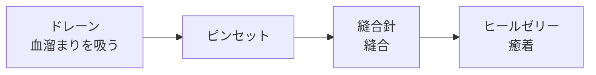

# 06 病巣

- ステータス：草案
- 最終更新：2026-09-25

## 1. 共通ルール

- 病巣は重ならない。
- 各病巣は治療手順（医療機器を使う順番）を持つ。
- 手順を間違えたとき、最初に戻るタイプと戻らないタイプがある（病巣ごとの区分は `TBD-06-3`）。
- 成功時の回復値と失敗時のダメージ値を持つ。
- 病巣があるあいだのバイタル減少（間隔と量）を持つ。病巣ごとに独立したタイマーで処理する（[03_game_rules.md](03_game_rules.md)）。
- 流血や膿がある状態ではヒールゼリーが効かない。
- データ形式は [07_data_format.md](07_data_format.md) 参照。

## 2. 病巣一覧

| 病巣 | 分類 | 識別文字 | 形状（判定データ） | 治療手順 |
|---|---|---|---|---|
| 切り傷 | 外傷：軽症 | a | 長い線 | ヒールゼリー |
| 裂傷 | 外傷：重症 | TBD | 厚みを持った線 | ドレーン → ピンセット → 縫合針 → ヒールゼリー |
| 破片痕 | 外傷 | TBD | 点 | ピンセット → ヒールゼリー |
| 腫瘍 | 外傷 | TBD | 大きさのある点 | TBD（`TBD-06-2`） |
| 切開 | - | TBD | 長い線 | ヒールゼリー（省略可）→ メス |

- 識別文字は、全種類が出そろってから考え直す（`TBD-06-5`）。
- 「形状」は、治療の成否を判定するための形（判定データ）を指す。見た目は別に画像として持つ（[04_surgery_area.md](04_surgery_area.md) 2章）。
- 判定データの詳しい形式は `TBD-04-3`。
- **この章は作成途中の箇所が多く、医療機器と合わせて再整理する**（`TBD-05-10`）。

## 3. 各病巣の仕様

### 3.1 切り傷（外傷：軽症）

- 形状：長い線
- 治療：ヒールゼリー

### 3.2 裂傷（外傷：重症）

- 形状：厚みを持った線
- 血溜まりができる。血溜まりはドレーンで吸い出せる。
- 一定時間後に出血して、再び血溜まりができる（時間は `TBD-06-4`）。

### 3.3 破片痕（外傷）

- 形状：点
- 治療：ピンセット → ヒールゼリー

### 3.4 腫瘍（外傷）

- 形状：大きさのある点
- 膿を吸い出さないと治療できない（ドレーンを使う）。
- 摘出前にヒールゼリーを生理食塩水の代わりに使う。
- 治療手順の全体は `TBD-06-2`。

### 3.5 切開

- 形状：長い線
- 判定データ：案として、通過点の座標のリスト（例：`[0,0]` `[5,5]` `[10,10]`）。判定方法の案は [05_instruments.md](05_instruments.md) 3.4（検討中）。
- メスで切開する箇所。
- 治療：ヒールゼリー（省略可）→ メス

| 状況 | 結果 |
|---|---|
| メスで失敗 | ダメージ |
| ヒールゼリーを省略 | メスで成功してもダメージ |

## 4. 未決事項

| ID | 内容 | 提案ID |
|---|---|---|
| TBD-06-1 | 「切開」を病巣に含めるか（総称を「処置対象」にするか） | F1 |
| TBD-06-2 | 腫瘍の治療手順 | F2 |
| TBD-06-3 | 病巣ごとの「失敗時に最初に戻るか」の区分 | F3 |
| TBD-06-4 | 時間経過による変化（再出血など）の秒数 | F4 |
| TBD-06-5 | 識別文字（英単語 ID にするか） | F5 |
| TBD-06-6 | 皮膚の中の異物（scenario.md ステージ1）の定義 | F6 |
| TBD-06-7 | 病巣ごとの回復値・ダメージ値・バイタル減少量 | - |
